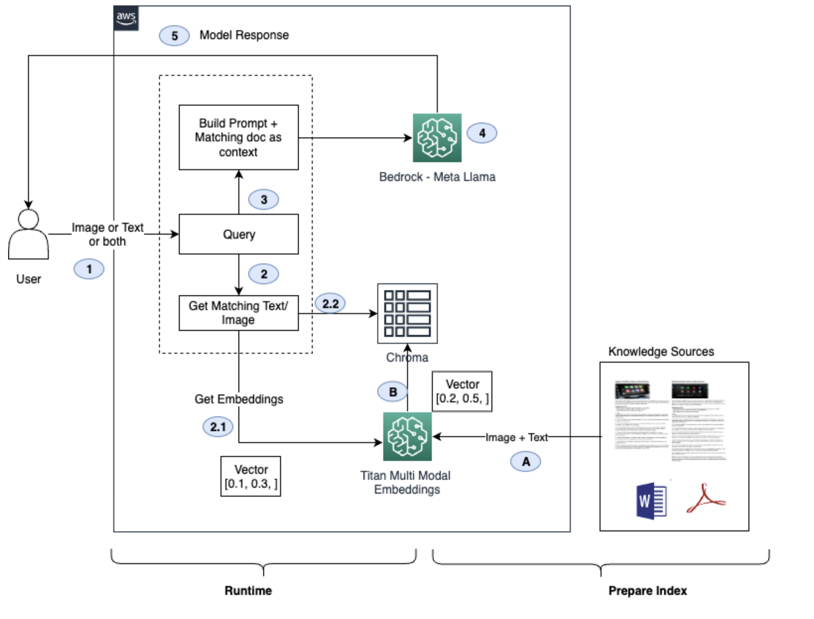

# Exploring Meta's Llama 3.2 on AWS Bedrock: A Blog Post

This repository contains the code and examples for the blog post "Exploring Meta's Llama 3.2 on AWS Bedrock". The blog post provides an overview of the multimodal capabilities of Meta's Llama 3.2 models, specifically the 11B parameter model, on the Amazon Bedrock service.

Meta's Llama 3.2 is a collection of large language models (LLMs) that combine sophisticated language processing with powerful image understanding. These models are now available on the AWS Bedrock service, allowing developers and researchers to easily use them within Amazon's robust and scalable cloud infrastructure.

## Summary of Llama 3.2 11B Model

- Multimodal model - input text and image
- Suitable for use cases requiring image analysis, document processing, and multimodal chatbots
- Max tokens: 128K
- Languages: English, German, French, Italian, Portuguese, Hindi, Spanish, and Thai

## Bedrock Playground and APIs

Llama 3.2 models can be accessed from the Bedrock playground using either the Converse API or the Invoke Model API. The blog post provides code examples for both APIs.

## Use Cases

The repository contains code examples for the following use cases:

1. OCR — Simple text extraction and extraction from nested structures
2. Diagram analysis — Comparing molar mass versus boiling points and some fictitious organic compounds
3. Predictive maintenance — Detecting dents and repairs in cars from images
4. Multi-modal RAG (Retrieval-Augmented Generation) — Allowing users to supply both text and images as input for querying, comparing, and analyzing data

For more information and detailed explanations, please refer to the blog post ["Exploring Meta's Llama 3.2 on AWS Bedrock"](https://community.aws/content/2myB8z4pfv6VG0BRICBhLP3AV64/multimodal-ai-with-llama-3-2-on-amazon-bedrock).